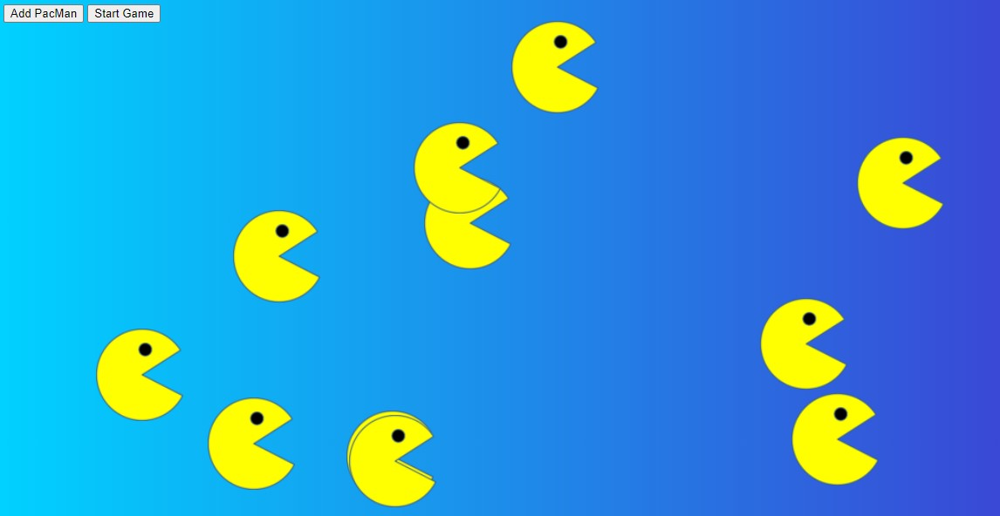

# PacMen Exercise

This project was part of the course work required in the MIT xPRO Full-Stack development course.

This project creates animated PacMen. Each time the "Add PacMan" button is pressed, a new PacMan is created at a different place on the screen. Once you like the amount of PacMen, the "Start Game" button can be clicked. This will cause the PacMen to start moving in all directions at different velocities. The PacMen also have collision detection when they hit the edge of the screen.

This was created using HTML, CSS, and Javascript.

## How To Run

Download index.html, pacmen.js, and all image files by clicking the green code button. Make sure to save them to the same directory on your computer. Load the index.html file into your browser. Press the "Add PacMan" button until you are satisfied with the quantity and then press the "Start Game" button to watch the PacMen move around the screen.

You can also interact with the page without having to download the files. 

<a href="https://leahselig.github.io/PacMen/"> Try It Out Here! </a>

## Roadmap

- [ ] Have the PacMen switch between images so it looks like the real PacMan moving his mouth

- [ ] Add in styling for the buttons

- [ ] Add in the PacMan music

## MIT License

Copyright (c) 2022 MIT

Permission is hereby granted, free of charge, to any person obtaining a copy of this software and associated documentation files (the "Software"), to deal in the Software without restriction, including without limitation the rights to use, copy, modify, merge, publish, distribute, sublicense, and/or sell copies of the Software, and to permit persons to whom the Software is furnished to do so, subject to the following conditions:

The above copyright notice and this permission notice shall be included in all copies or substantial portions of the Software.

THE SOFTWARE IS PROVIDED "AS IS", WITHOUT WARRANTY OF ANY KIND, EXPRESS OR IMPLIED, INCLUDING BUT NOT LIMITED TO THE WARRANTIES OF MERCHANTABILITY, FITNESS FOR A PARTICULAR PURPOSE AND NONINFRINGEMENT. IN NO EVENT SHALL THE AUTHORS OR COPYRIGHT HOLDERS BE LIABLE FOR ANY CLAIM, DAMAGES OR OTHER LIABILITY, WHETHER IN AN ACTION OF CONTRACT, TORT OR OTHERWISE, ARISING FROM, OUT OF OR IN CONNECTION WITH THE SOFTWARE OR THE USE OR OTHER DEALINGS IN THE SOFTWARE.
